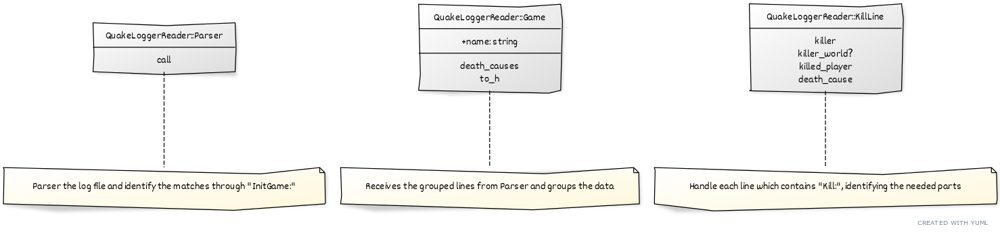

# Quaker Logger Reader

This project is a Cloudwalk technical test.

The main purpose is to be able to read a server log, as you can see on 'spec/fixtures/qgames.log' and do required tasks about it!

## Tasks

The tasks are:

1 - Parse the log and group the data into sensible blocks, like below:

```json
"game_1": {
  "total_kills": 45,
  "players": ["Dono da bola", "Isgalamido", "Zeh"],
  "kills": {
    "Dono da bola": 5,
    "Isgalamido": 18,
    "Zeh": 20
  }
}
```

Observations:

- When '<world>' kill a player, that player loses -1 kill score;
- '<world>' is not a player, so it should not appear on players and kills list;
- total_kills sums up player and world kills.

2 - Make the report with grouped data parsed on the task 1.
3 - Make the report based on death causes grouped by each match, like below:

```json
"game_1": {
  "kills_by_means": {
    "MOD_SHOTGUN": 10,
    "MOD_RAILGUN": 2,
    "MOD_GAUNTLET": 1,
    ...
  }
}
```

## Project

The rational about the project is we don't need the whole rails project to process this file and making such parser as a lib or a gem is much better to reuse among other projects, allowing the rails app which will use this much more maintainable and clean, since its code is located separately (lib folder inside a rails project or another repository and required as a gem)

Below I attached a diagram, to help navigate through the code:



Shared YUML code:

```
[QuakeLoggerReader::Parser|call]-[note: Parser the log file and identify the matches through "InitGame:"]

[QuakeLoggerReader::Game|+name: string|death_causes;to_h]-[note: Receives the grouped lines from Parser and groups the data]

[QuakeLoggerReader::KillLine|killer;killer_world?;killed_player;death_cause]-[note: Handle each line which contains "Kill:", identifying the needed parts]
```

#### Tech Stack

Ruby 3.2.2
RSpec (yes, we've tests for all the things, this is a good coverage)

#### How to use

To use this project:

1 - You'll need ruby 3.2.2 installed probably with Windows + WSL, Linux or MacOS to run;
2 - After install, clone this repository;
3 - Go to the path where you cloned;
4 - Run `bundle install`;
5 - Run `ruby main.rb -h` for help;

The CLI was really simple, with options to list all the matches and their data
(-m or --match) and another option to list all death causes and their data
(-d or --death-cause).

To both of them you can pass an integer representing the number of the match,
if you pass an invalid match, the code will report that the match could not be
found!

You can run the CLI using the commands above with the file on the mentioned
path before or you can pass a new path to the command and read another file
with the same structure too, like that:

```sh
ruby main.rb ~/me/new_game.log -d
```

To run tests, is simple just run `bundle exec rspec --format=progress`
